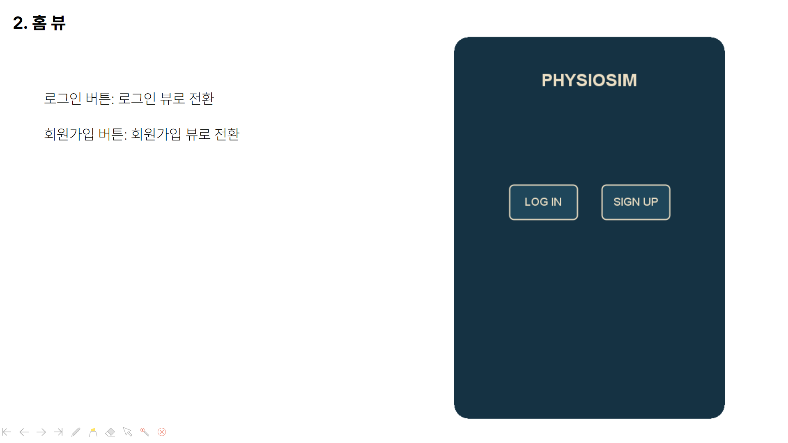
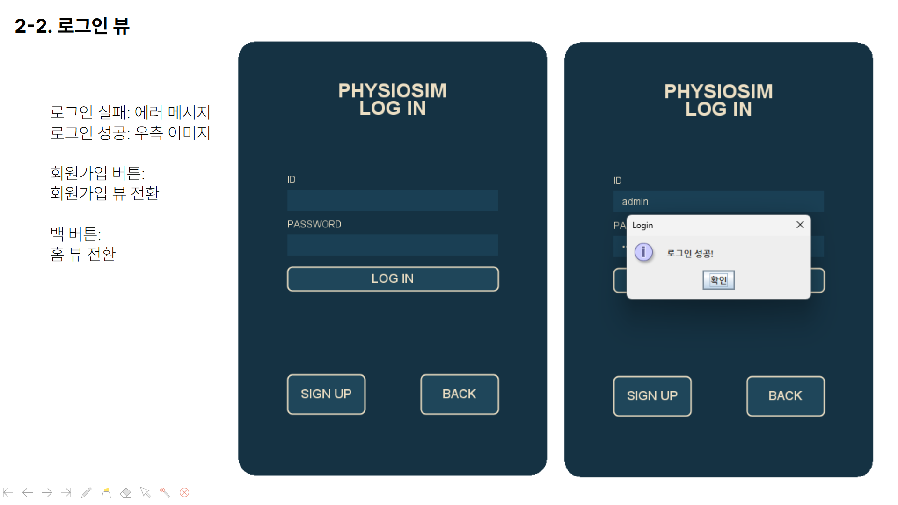
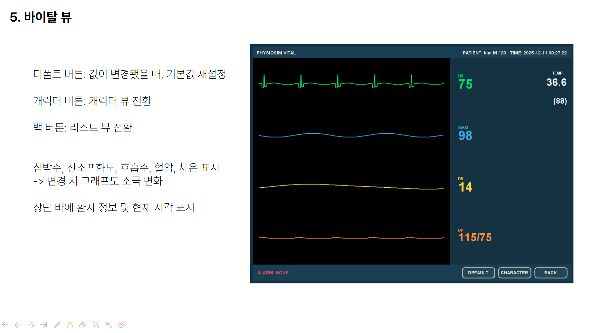
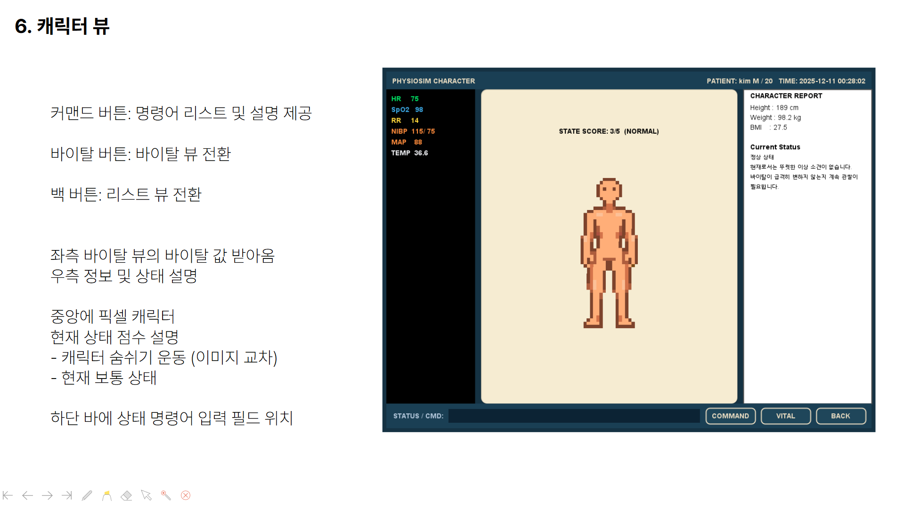
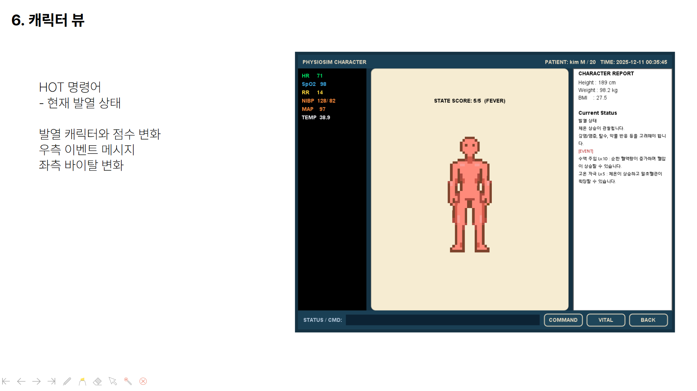
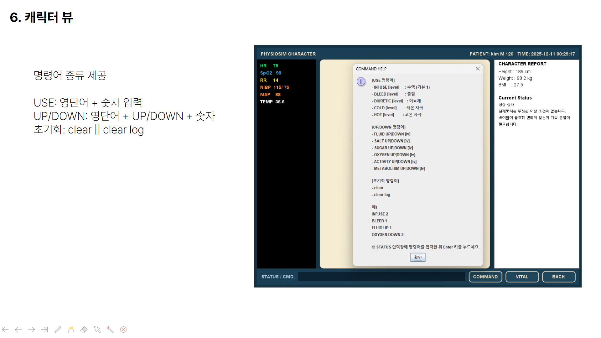

# PhysioSim
Java-based physiology simulation platform for modeling and visualizing vital signs.

인체 생리학 개념을 기반으로 한 자바 기반 시뮬레이션 프로젝트이다.  
생리 신호를 모델링하고, 시각화 인터페이스를 통해 인체 상태 변화를 관찰할 수 있도록 설계하였다.

---

## 소개

- 계층 구조  
  **세포 → 조직 → 기관 → 기관계 → 개체(sim)**

- 목표  
  하나의 공통 시뮬레이션 코어 위에서 다양한 생리 시스템이 상호작용하도록 구성

- 개발 환경  
  **Eclipse / JDK 17 / SQLite (JDBC)**

---

## 주요 기능

### 1. 사용자 입력 기반 캐릭터 생성
- 성별, 키, 체중 입력
- DB에 저장된 정보를 기반으로 캐릭터의 기본 파라미터 초기화

### 2. 생리학적 상호작용 모델
- 생리 이벤트 기반 시뮬레이션
- 각 이벤트는 바이탈 변화와 캐릭터 상태를 동시에 변화시킨다.

### 3. 시각화 인터페이스

- 실시간 그래프 및 수치 표시
- 상태 알람 시스템
- 개입 패널 (산소 공급, 출혈, 수액 등)
- 캐릭터 상태 표현
  - 호흡 변화
  - 피부색 변화
  - 상태 아이콘

핵심 바이탈 카드

- HR (Heart Rate)
- RR (Respiratory Rate)
- SpO₂ (Oxygen Saturation)
- MAP (Mean Arterial Pressure)

---

## 설계 개요

### 패키지 구조

```
physiosim.sim
 ├ Cell
 ├ Tissue
 ├ Core
 ├ EventConsumer
 ├ Organ
 ├ OrganSystem
 ├ Snapshot
 └ SpriteState

physiosim.control
 └ Simulation

physiosim.db
 ├ Database
 ├ UserRepository
 ├ CharacterRepository
 ├ VitalRepository
 └ Passwords

physiosim.ui
 ├ App
 ├ Navigator
 ├ Theme
 └ views
     ├ SplashView
     ├ HomeView
     ├ SignupView
     ├ LoginView
     ├ MainView
     ├ PersonalView
     ├ CharacterCreateView
     ├ AccountView
     ├ ListView
     ├ VitalView
     └ CharacterView

physiosim.event
 ├ Command
 ├ CommandDirection
 ├ CommandId
 ├ CommandMapper
 ├ PhysioEvent
 └ TargetSystem
```

## Database Bootstrapping

Database 초기화 규칙
- `Database.open(path)`
  - 데이터베이스 연결 수행
- `Database.setup(connection)`
  - PRAGMA 설정
  - 스키마 생성 (멱등 처리)
- PRAGMA foreign_keys = ON;
- PRAGMA journal_mode = WAL;
- PRAGMA synchronous = NORMAL;
- PRAGMA temp_store = MEMORY;
- PRAGMA busy_timeout = 5000;

---

## Interface

### Splash Screen


### Home Screen


### Login Screen


### Vital Dashboard


### Character Normal


### Character Fever


### Command System


---

## Devlog

### Day 1
- GitHub Repository 생성
- README 초안 작성
- 프로젝트 구조 설계
- 패키지 구성

### Day 2
- SQLite 연동
- DB 초기화 로직 구현
- 사용자 기본 정보 저장 기능 구현

### Day 3
- 로그인 / 회원가입 기능 구현
- 비밀번호 처리 로직 추가
- 데이터 구조 재정립  
  (사용자 계정 → 다중 캐릭터 → 캐릭터별 바이탈 데이터)

### Day 4
- Repository 구조 리팩토링
- Database 스키마 제약 및 인덱스 수정
- 로그인 / 회원가입 UI 기본 틀 구현

### Day 5
- Splash / MainFrame / HomeView 디자인 완성
- 로그인 / 회원가입 화면 구성
- 전체 UI 흐름 정리

### Day 6
- Theme 기반 UI 디자인 통일
- 개인 뷰 / 캐릭터 생성 / 계정 설정 / 캐릭터 리스트 화면 구성

### Day 7
- 도트 캐릭터 제작
- 바이탈 뷰 계산 로직 설계
- 인터페이스 구조 정리

### Day 8
- Vital View 구현
- Character View 구현

### Day 9
- Vital View 입력 오류 처리

### Day 10
- Character View 로그 제어 기능 추가

---

## Technical Notes

단위
- bpm
- %
- mmHg
- ℃
- mg·dL

MAP 계산식
- MAP = DBP + (SBP - DBP) / 3
