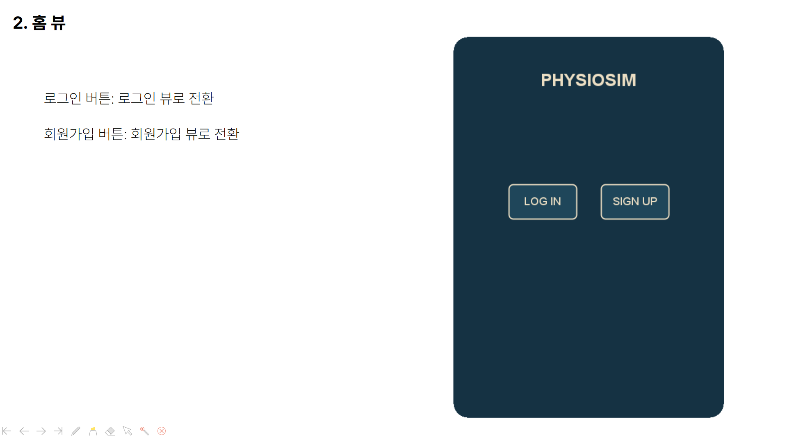
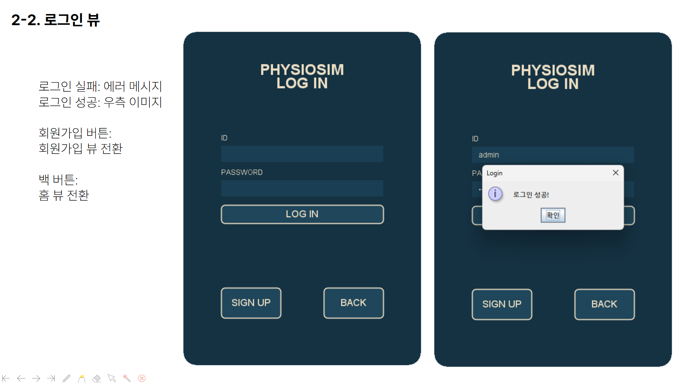
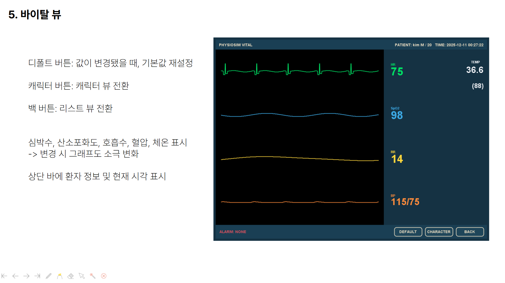
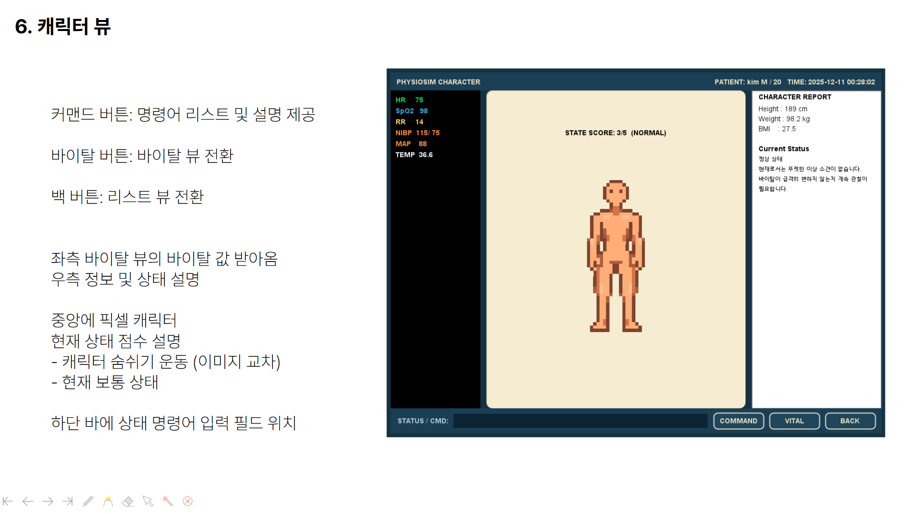
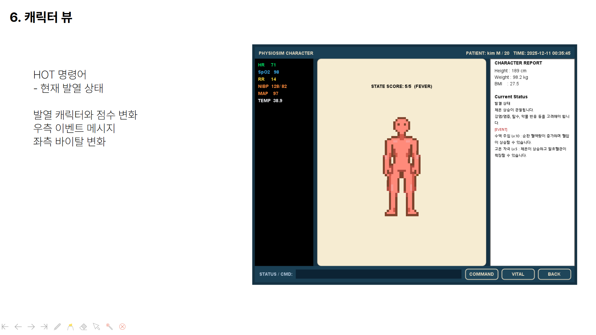
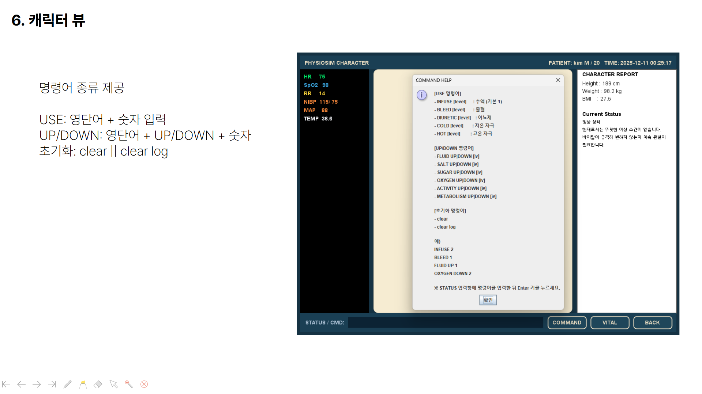

# PhysioSim
Java-based physiology simulation platform for modeling and visualizing vital signs.

인체 생리학 개념을 기반으로 한 자바 기반 시뮬레이션 프로젝트이다.  
생리 신호를 모델링하고, 시각화 인터페이스를 통해 인체 상태 변화를 관찰할 수 있도록 설계하였다.

---

## 소개

- 계층 구조  
  **세포 → 조직 → 기관 → 기관계 → 개체(sim)**

- 목표  
  하나의 공통 시뮬레이션 코어 위에서 다양한 생리 시스템이 상호작용하도록 구성

- 개발 환경  
  **Eclipse / JDK 17 / SQLite (JDBC)**
  
---

## 향후 개발 방향

PhysioSim은 이후 개발될 **VitaCore 플랫폼의 프로토타입** 역할을 한다.

향후에는 다음과 같은 방향으로 확장할 예정이다.

- 웹 기반 플랫폼 구조로 확장
- 생리 시뮬레이션 모델 확장
- 실시간 데이터 연동
- 바이탈 데이터 테이블 자동 초기화 및 UI 연동 보완
- 인터페이스 및 시스템 구조 개선

---

## 현재 구현 범위

PhysioSim currently focuses on **vital-level physiological simulation**.  
바이탈 신호의 변화를 시뮬레이션하고, 캐릭터 상태 변화와 대시보드를 통해 이를 시각적으로 표현한다.

현재 구현된 기능은 다음과 같다.

- Java Swing 기반 바이탈 대시보드 시각화
- 명령어 기반 생리 이벤트 시스템
- 캐릭터 상태 변화 및 상태별 스프라이트 표현
- SQLite 기반 사용자 / 캐릭터 데이터 저장 및 조회
- JDBC Repository 기반 바이탈 데이터 저장 / 조회 로직 구현

대표 이벤트 예시

- BLEED → hypotension
- COLD → hypothermia
- HOT → fever
- INFUSE → hypertension

---

## 주요 기능

### 1. 사용자 관리
- 회원가입 및 로그인 기능
- 사용자 ID, 이메일, 역할, 비밀번호 해시 저장
- `UserRepository`를 통한 사용자 등록 및 로그인 검증

### 2. 사용자 입력 기반 캐릭터 생성
- 성별, 생년월일, 키, 체중 입력
- 입력값 검증 후 SQLite `characters` 테이블에 저장
- 로그인 사용자 기준 캐릭터 목록 조회
- 저장된 캐릭터 정보를 기반으로 바이탈 / 캐릭터 화면의 기본 표시값 구성

### 3. 생리학적 상호작용 모델
- 생리 이벤트 기반 시뮬레이션
- 각 이벤트는 바이탈 변화와 캐릭터 상태를 동시에 변화시킨다.
- `Simulation`, `Core`, `CommandMapper`를 통해 명령어를 생리 이벤트로 변환한다.

### 4. 시각화 인터페이스

- 실시간 그래프 및 수치 표시
- 상태 알람 시스템
- 개입 패널 (산소 공급, 출혈, 수액 등)
- 캐릭터 상태 표현
  - 호흡 변화
  - 피부색 변화
  - 상태 아이콘

핵심 바이탈 카드

- HR (Heart Rate)
- RR (Respiratory Rate)
- SpO₂ (Oxygen Saturation)
- MAP (Mean Arterial Pressure)

---

## 설계 개요

### 패키지 구조

```
physiosim.sim
 ├ Cell
 ├ Tissue
 ├ Core
 ├ EventConsumer
 ├ Organ
 ├ OrganSystem
 ├ Snapshot
 └ SpriteState

physiosim.control
 └ Simulation

physiosim.db
 ├ Database
 ├ UserRepository
 ├ CharacterRepository
 ├ VitalRepository
 └ Passwords

physiosim.ui
 ├ App
 ├ Navigator
 ├ Theme
 └ views
     ├ SplashView
     ├ HomeView
     ├ SignupView
     ├ LoginView
     ├ MainView
     ├ PersonalView
     ├ CharacterCreateView
     ├ AccountView
     ├ ListView
     ├ VitalView
     └ CharacterView

physiosim.event
 ├ Command
 ├ CommandDirection
 ├ CommandId
 ├ CommandMapper
 ├ PhysioEvent
 └ TargetSystem
```

### 구조적 특징

- `physiosim.ui.views`: Swing 화면 컴포넌트
- `physiosim.ui.App`: 화면 전환, 로그인 상태 관리, Repository 호출 흐름 담당
- `physiosim.ui.Navigator`: Vital 화면과 Character 화면 전환 및 공통 Simulation 공유
- `physiosim.sim`, `physiosim.control`: 생리 시뮬레이션 도메인 로직
- `physiosim.event`: 명령어와 생리 이벤트 매핑
- `physiosim.db`: SQLite 연결 및 Repository 기반 데이터 접근

---

## Database Bootstrapping

### Database 초기화 규칙
PhysioSim은 SQLite 데이터베이스를 사용하며, `Database` 클래스가 로딩될 때 자동으로 데이터베이스 초기화를 수행한다.

`Database.getConnection()`
- SQLite 데이터베이스 `data/physiosim.db`에 연결한다.

`Database.init()`
- 클래스 로딩 시 자동 실행되며 데이터베이스 스키마를 초기화한다.

스키마 생성 (멱등 처리)
- `CREATE TABLE IF NOT EXISTS` 구문을 사용하여 테이블이 존재하지 않을 경우에만 생성한다.

현재 자동 생성되는 테이블은 다음과 같다.
- `users`
- `characters`

### 주요 테이블

#### users
- `user_id`: 사용자 ID, Primary Key
- `email`: 사용자 이메일, Unique
- `password_hash`: 비밀번호 해시
- `role`: `CLINICIAN` 또는 `RESEARCHER`
- `created_at`: 생성 시각

#### characters
- `id`: 캐릭터 ID, Auto Increment
- `owner_id`: 캐릭터 소유 사용자 ID
- `name`: 캐릭터 이름
- `sex`: 성별
- `birth`: 생년월일, YYYYMMDD
- `height_cm`: 키
- `weight_kg`: 몸무게
- `created_at`: 생성 시각

### 바이탈 데이터 저장소 구현 상태

`VitalRepository`에는 `vitals` 테이블을 기준으로 다음 메서드가 구현되어 있다.

- `insert(...)`: 캐릭터별 바이탈 기록 저장
- `findLatestByCharacter(...)`: 특정 캐릭터의 최신 바이탈 조회
- `findByCharacter(...)`: 특정 캐릭터의 전체 바이탈 조회
- `findByCharacterBetween(...)`: 기간 조건으로 바이탈 조회

현재 `Database.init()`에서 자동 생성되는 테이블은 `users`, `characters`, `vitals`이다.
`vitals.character_id`는 `characters.id`를 참조하며, 캐릭터 삭제 시 관련 바이탈 기록도 함께 삭제되도록 구성했다.

---

## CRUD 구현 상태

- 사용자: 회원가입(Create), 로그인용 조회(Read)
- 캐릭터: 생성(Create), 단건/목록 조회(Read), 삭제(Delete)
- 바이탈: Repository 레벨 저장(Create), 최신/전체/기간 조회(Read)
- 수정(Update): 현재 명확한 수정 기능은 별도 구현 대상

---

## Security Improvements

- 비밀번호 저장 로직은 `Passwords` 클래스에서 bcrypt 기반 해시로 처리한다.
- 회원가입 시 `UserRepository.register(...)`가 `Passwords.hash(...)` 결과를 `users.password_hash`에 저장한다.
- 로그인 시 `UserRepository.login(...)`이 `Passwords.verify(...)`로 입력 비밀번호와 저장 해시를 비교한다.
- bcrypt 의존성은 Maven `pom.xml`의 `org.mindrot:jbcrypt`로 관리한다.

---

## Test Coverage

`SimulationTest`는 기본 바이탈, 시간 진행 예외 처리, 스트레스 경계값, 강한 출혈 명령 후 안전 범위 유지 여부를 검증한다.

테스트 실행:

```bash
mvn test
```

---

## Interface

### Splash Screen


### Home Screen


### Login Screen


### Vital Dashboard


### Character Normal


### Character Fever


### Command System


---

## Devlog

### Day 1
- GitHub Repository 생성
- README 초안 작성
- 프로젝트 구조 설계
- 패키지 구성

### Day 2
- SQLite 연동
- DB 초기화 로직 구현
- 사용자 기본 정보 저장 기능 구현

### Day 3
- 로그인 / 회원가입 기능 구현
- 비밀번호 처리 로직 추가
- 데이터 구조 재정립  
  (사용자 계정 → 다중 캐릭터 → 캐릭터별 바이탈 데이터)

### Day 4
- Repository 구조 리팩토링
- Database 스키마 제약 및 인덱스 수정
- 로그인 / 회원가입 UI 기본 틀 구현

### Day 5
- Splash / MainFrame / HomeView 디자인 완성
- 로그인 / 회원가입 화면 구성
- 전체 UI 흐름 정리

### Day 6
- Theme 기반 UI 디자인 통일
- 개인 뷰 / 캐릭터 생성 / 계정 설정 / 캐릭터 리스트 화면 구성

### Day 7
- 도트 캐릭터 제작
- 바이탈 뷰 계산 로직 설계
- 인터페이스 구조 정리

### Day 8
- Vital View 구현
- Character View 구현

### Day 9
- Vital View 입력 오류 처리

### Day 10
- Character View 로그 제어 기능 추가

---

## Technical Notes

단위
- bpm
- %
- mmHg
- ℃
- mg·dL

MAP 계산식
- MAP = DBP + (SBP - DBP) / 3

비밀번호 처리
- 현재 `Passwords` 클래스에서 bcrypt 기반 해시를 사용한다.

---

## Troubleshooting & Improvements

이 프로젝트를 GitHub 코드 리뷰 및 포트폴리오 피드백을 바탕으로 개선한 내용을 기록합니다.

### 1. Password Hashing

#### Problem

* 비밀번호를 단순 SHA-256으로 해싱하여 저장하고 있었습니다.
* Salt가 없어 Rainbow Table 및 Brute Force 공격에 취약했습니다.

#### Solution

* SHA-256을 BCrypt로 변경했습니다.
* 회원가입 시 BCrypt Hash를 저장하고 로그인 시 BCrypt Verify를 수행하도록 수정했습니다.

#### Result

* Salt 기반 Password Hashing 적용
* 실무에서 일반적으로 사용하는 Password Storage 방식으로 개선

---

### 2. Database Initialization

#### Problem

* 새 데이터베이스 생성 시 `vitals` 테이블이 자동 생성되지 않았습니다.

#### Solution

* Database 초기화 과정에서 vitals 테이블과 필요한 Index를 자동 생성하도록 수정했습니다.
* SQLite Foreign Key(PRAGMA foreign_keys = ON)를 활성화했습니다.

#### Result

* Fresh DB에서도 정상 실행
* Referential Integrity 강화

---

### 3. Simulation Test Coverage

#### Problem

* Simulation 핵심 로직에 자동화 테스트가 존재하지 않았습니다.

#### Solution

* JUnit 테스트를 추가했습니다.
* 초기값
* Tick 처리
* Stress 상한/하한
* Bleeding 명령
* Clamp 범위를 검증합니다.

#### Result

* 주요 Simulation 로직 회귀 테스트 가능
* 향후 리팩토링 안정성 향상

---

### Compatibility Note

BCrypt는 기존 SHA-256 해시와 호환되지 않습니다.

기존 테스트 계정은 재가입하거나 Password Migration이 필요합니다.
